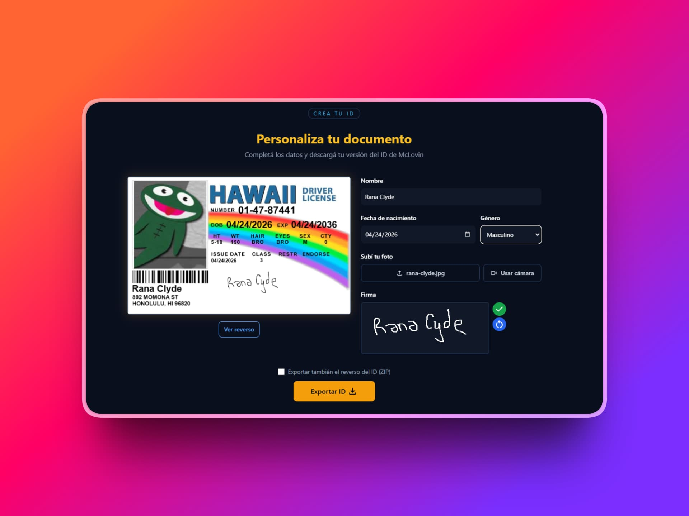

<div align="center">

# 🪪 My McLovin ID

**Crea tu propia versión del ID más famoso del cine**

[](https://mymclovinid.netlify.app/)
[](https://astro.build)
[](https://tailwindcss.com)
[](https://typescriptlang.org)

---



</div>

## ¿Qué es esto?

Una webapp inspirada en el icónico ID falso de **Fogell / McLovin** de la película *Superbad* (2007). Completás tus datos, subís una foto, firmás y descargás tu propio documento estilo Hawaii — tal como haría McLovin.

---

## ✨ Funcionalidades

- **Personalización en tiempo real** — el ID se renderiza en canvas mientras escribís
- **Subida y recorte de foto** — con zoom y encuadre ajustable (powered by Croppie)
- **Cámara integrada** — tomá una selfie directo desde el navegador
- **Firma digital** — dibujá tu firma con el dedo o el mouse
- **Exportar como PNG** — descargá el frente del ID con un click
- **Exportar ZIP** — descargá frente y reverso juntos como `.zip`
- **Soporte i18n** — disponible en Español e Inglés
- **Diseño responsive** — funciona en mobile y desktop

---

## 🛠️ Stack tecnológico

| Tecnología | Uso |
|---|---|
| [Astro 5](https://astro.build) | Framework principal (SSG, sin JS innecesario) |
| [Tailwind CSS 3](https://tailwindcss.com) | Estilos utilitarios |
| [TypeScript](https://typescriptlang.org) | Tipado estático en modo strict |
| [butterup-toast](https://butterup-toast.netlify.app) | Notificaciones toast |
| [Croppie](https://foliotek.github.io/Croppie/) | Recorte y zoom de la foto de perfil |
| [JSZip](https://stuk.github.io/jszip/) | Exportación de ambas caras del ID en ZIP |
| [Netlify](https://netlify.com) | Hosting y deploy |

---

## 🚀 Desarrollo local

**Requisitos:** Node.js 18+ y [pnpm](https://pnpm.io)

```bash
# Instalar dependencias
pnpm install

# Iniciar servidor de desarrollo en localhost:4321
pnpm dev

# Verificar tipos y compilar para producción
pnpm build

# Preview del build de producción
pnpm preview
```

---

## 🗂️ Estructura del proyecto

```
src/
├── pages/
│   └── index.astro          # Página principal (single-page app)
├── sections/
│   ├── CreateID.astro        # Formulario y lógica de creación del ID
│   ├── Hero.astro            # Sección hero
│   └── About.astro           # Sección sobre McLovin
├── components/
│   ├── McLovinCanvas.astro   # Canvas que renderiza el ID en tiempo real
│   ├── TakePhoto.astro       # Subida, recorte y cámara de foto
│   └── Sign.astro            # Pad de firma digital
├── i18n/
│   └── translations.ts       # Textos en ES e EN
├── const/
│   └── mclovinData.ts        # Coordenadas de pixel para el canvas
└── utils/
    ├── domSelector.ts         # Shorthand tipado para querySelector
    └── formattedDate.ts       # Formateo de fechas US MM/DD/YYYY
```

---

## 🎬 El personaje

> *"It's McLovin... just McLovin."*

McLovin es el alter ego de Fogell en *Superbad* (2007). Con un único nombre en su ID falso del Estado de Hawaii —sin apellido, sin dirección—, se convirtió en uno de los momentos más icónicos de la comedia de los 2000s.

---

<div align="center">

Hecho con ❤️ y demasiadas referencias a Superbad

</div>
